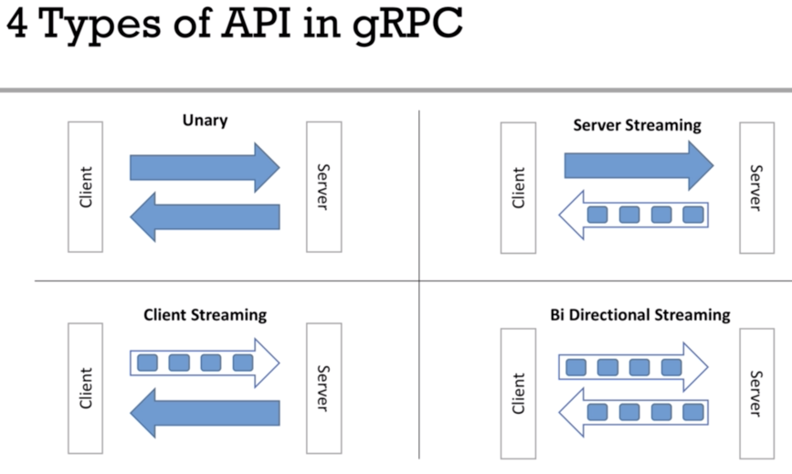

# Grpc-learning
Here, I am learning and trying out gRPC, a modern way to make different parts of software talk to each other quickly and efficiently. Exploring examples to see how to use gRPC for building software that works well across many computers. Just learning how gRPC can help make my programs faster and more reliable!

# Grpc Status Codes
Reference Link for status codes
https://github.com/grpc/grpc/blob/master/doc/statuscodes.md

Reference Link for codes proto
https://github.com/googleapis/googleapis/blob/master/google/rpc/code.proto

# Scalar Value Types

| .proto Type	 | Java Types |
|:-:|:--:|
|double |double |
|float |float |
|int32 |int |
|int64 |long |
|uint32 |int |
|uint64 |long |
|sint32 |int |
|sint64 |long |
|fixed32 |int |
|fixed64 |long |
|sfixed32 |int |
|sfixed64 |long |
|bool |boolean |
|string |string |
|bytes |Bytestring |

